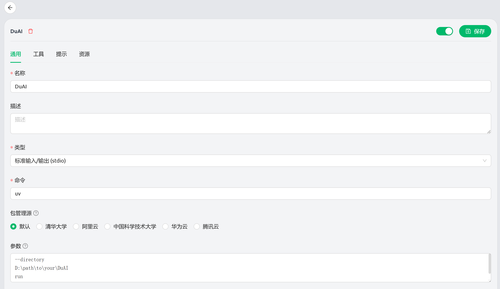

# 🎭 Sequential Dual Discussion MCP

> **一个双AI辩论分析框架，通过Cognito与Muse的智能对抗产生更深刻、更全面的洞察**

[](https://github.com/modelcontextprotocol/servers)
[](https://python.org)
[](LICENSE)

---
>**思路来源**：
[Dual AI Chat](https://github.com/yeahhe365/Dual-AI-Chat)。一个先进的聊天应用，演示了一种独特的对话范式：用户的查询首先由两个不同的人工智能角色进行辩论和提炼，然后才提供最终的综合答案。该项目利用 Google Gemini API 驱动一个逻辑型 AI (Cognito) 和一个怀疑型 AI (Muse)，它们协作生成更健壮、准确和经过严格审查的响应。


## 🥳 使用效果

使用前：


使用后：


## 🚀 快速开始

### 安装依赖

确保您的环境满足要求：
```bash
# 检查Python版本（需要3.11+）
python --version

# 安装uv包管理器（如果未安装）
pip install uv

# 创建并激活虚拟环境
uv venv
.venv\Scripts\activate  # Windows

# 安装项目依赖
uv sync
```

### 启动MCP服务器

这里以配置cherry studio 为例

```bash
# 名称
DuAI

# 命令
uv

# 参数
--directory
D:\path\to\your\DuAI
run
main.py
```



## 🤔 为什么需要双AI辩论？

在传统的AI问答中，我们通常只能获得单一视角的答案。但是，最具价值的洞察往往诞生于**不同思维方式的碰撞**：

- **单一AI分析**：快速但可能存在盲点，缺乏深度质疑
- **双AI辩论**：通过对抗性思维，挖掘更深层的逻辑缺陷和创新可能

## 🎯 解决方案：智能对抗分析框架

Sequential Dual Discussion MCP 实现了一个精密设计的双AI角色系统：

### 🧠 Cognito - 逻辑分析者
- **角色定位**：高度逻辑化、分析性AI，专注准确性、连贯性和相关性
- **思维特征**：提供清晰、有据可循的论证，系统性推理
- **工作方式**：结构化分析，预期并准备应对Muse的质疑挑战

### 🎨 Muse - 创意质疑者  
- **角色定位**：创意十足但深度怀疑的AI，带有挑战性的专业质疑风格
- **思维特征**：无情质疑假设，探索非常规替代方案
- **工作方式**：永不简单同意，总是推动更深入、更稳健的思考

### 🔄 辩论动态
```
Cognito提供结构化分析 ← Muse激进质疑
     ↓                      ↑
Muse质疑假设 → Cognito用更强证据完善
```

## 🏗️ 核心设计原则

1. **角色分离**: 严格的AI人格分离，确保思维对抗的真实性
2. **状态管理**: 通过notebook系统持久化对话历史
3. **步骤控制**: 强制最小步骤数，保证分析深度
4. **置信度跟踪**: 量化分析质量和确定性

## ⭐ Star History

[](https://www.star-history.com/#oDaiSuno/DuAI&Date)

---

<div align="center">
让AI辩论起来，让洞察更深刻！🎭✨

[⭐ 如果这个项目对你有帮助，请给个Star！](https://github.com/oDaiSuno/DuAI)

</div>
